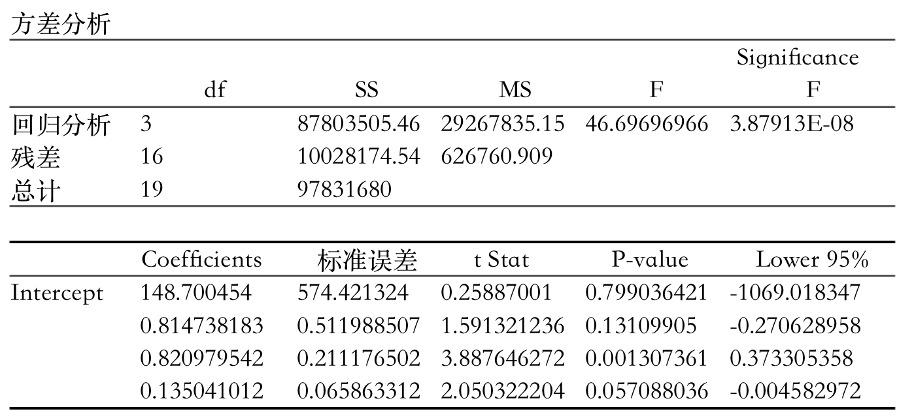

## 4
### 一、（20分）在2008年8月10日举行的第29届北京奥运会男子10米气手枪决赛中，最后获得金牌和银牌的两名运动员10枪的决赛成绩如下表所示：
|庞伟|9.3|10.3|10.5|10.3|10.4|10.3|10.7|10.4|10.7|9.3|
|:---|:-:|:-:|:-:|:-:|:-:|:-:|:-:|:-:|:-:|:-:|
|秦钟午|9.5|9.9|10.6|10.3|9.4|10.2|10.1|10.8|9.9|9.8|

根据上表计算的韩国运动员秦钟午的平均环数是10.05环，标准差是0.445环。比较分析哪个运动员的发挥更稳定。

### 二、（20分）什么是统计意义上的显著性？为什么说统计上显著不一定就有现实意义？

### 三、（20分）简要说明判断一组数据是否服从正态分布的统计方法。

### 四、（20分）国家统计局目前对地区的划分中，将我国31个省市自治区划分为东部地区、中部地区、西部地区、东北地区。
（1）要分析四个地区的平均消费水平是否存在显著差异，所用的统计方法有哪些？这些方法的区别是什么？
（2）你会选择什么方法进行分析？你的假设是什么？

### 五、（20分）一家房地产评估公司想对某城市的房地产销售价格 （元/）与地产的评估价值 （万元）、房产的评估价值 （万元）和使用面积 （）建立一个模型，以便对销售价格作出合理预测。为此，收集了20栋住宅的房地产评估数据，由统计软件给出的部分回归结果如下（显著性水平为95%）：
					

对所建立的回归模型进行综合评价。
[该题解答](https://wenku.baidu.com/view/54385ba11a37f111f1855b69.html)

